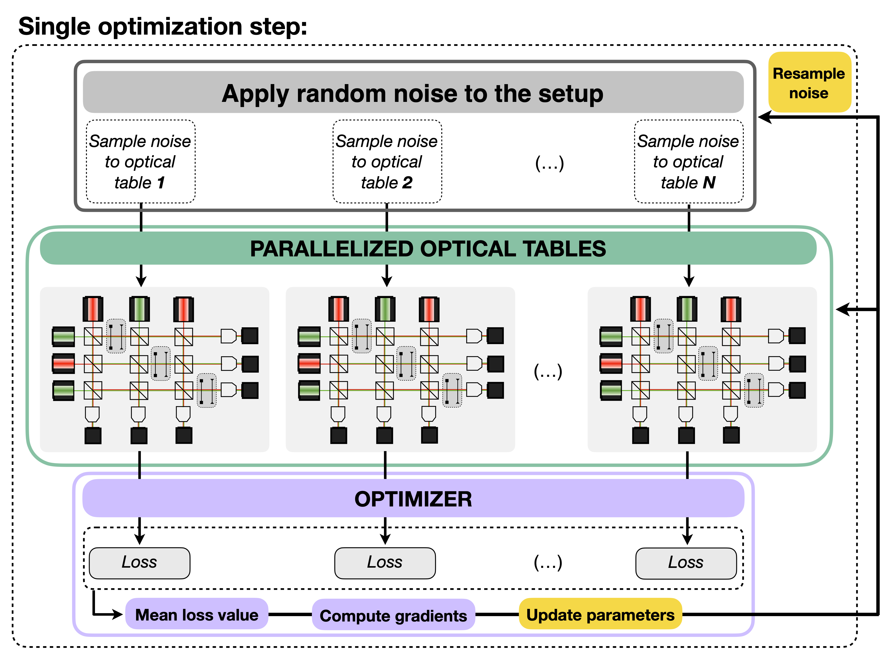

# ✨ XLuminA ✨

[](https://arxiv.org/abs/2310.08408)
[](https://pepy.tech/project/xlumina)
[](https://opensource.org/licenses/MIT)

[](https://pypi.org/project/xlumina/)
[](https://badge.fury.io/py/xlumina)
[](https://github.com/artificial-scientist-lab/XLuminA/stargazers)

 **XLuminA, a highly-efficient, auto-differentiating discovery framework for super-resolution microscopy**

📖 <u> Read our paper here: </u>\
[**XLuminA: An Auto-differentiating Discovery Framework for Super-Resolution Microscopy**](https://arxiv.org/abs/2310.08408#)\
*Carla Rodríguez, Sören Arlt, Leonhard Möckl and Mario Krenn*

📚 <u> Related works featuring XLuminA:  </u>

[](https://openreview.net/forum?id=ik9YuAHq6J&referrer=%5Bthe%20profile%20of%20Carla%20Rodríguez%5D(%2Fprofile%3Fid%3D~Carla_Rodríguez1)) **AI4Science Workshop** - *Oral contribution* 

[](https://openreview.net/forum?id=J8HGMimNYe&referrer=%5Bthe%20profile%20of%20Carla%20Rodríguez%5D(%2Fprofile%3Fid%3D~Carla_Rodríguez1)) **AI4Science Workshop -** *Oral contribution*

## 💻 Installation: 

### Using PyPI:

Create a new conda environment and install `xlumina`from PyPI. We recommend using `python=3.11`: 
```
conda create -n xlumina_env python=3.11

conda activate xlumina_env

pip install xlumina
```

It should be installed in about 10 seconds. The package automatically installs:

1. [**JAX (CPU only) and jaxlib**](https://jax.readthedocs.io/en/latest/index.html) (the version of JAX used in this project is v0.4.33), 

2. [**Optax**](https://github.com/google-deepmind/optax/tree/master) (the version of Optax used in this project is v0.2.3), 

3. [**SciPy**](https://scipy.org) (the version of SciPy used in this project is v1.14.1).

### Clone repository:
```
git clone https://github.com/artificial-scientist-lab/XLuminA.git
```

### GPU compatibility:

To install [JAX with NVIDIA GPU support](https://jax.readthedocs.io/en/latest/installation.html) (**Note: wheels only available on linux**), use CUDA 12 installation:

```
pip install --upgrade "jax[cuda12]"
```

XLuminA has been tested on the following operating systems:

Linux Enterprise Server 15 SP4 15.4,

and it has been successfully installed in Windows 10 (64-bit) and MacOS Monterey 12.6.2 


# 👾 Features:

XLuminA allows for the simulation, in a (*very*) fast and efficient way, of classical light propagation through optics hardware configurations,and enables the optimization and automated discovery of new setup designs.


 
The simulator contains many features:

✦ Light sources (of any wavelength and power) using both scalar or vectorial optical fields.

✦ Phase masks (e.g., spatial light modulators (SLMs), polarizers and general variable retarders (LCDs)).

✦ Amplitude masks (e.g., spatial light modulators (SLMs) and pre-defined circles, triangles and squares).

✦ Beam splitters, fluorescence model for STED, and more! 

✦ The light propagation methods available in XLuminA are:

  - [Fast-Fourier-transform (FFT) based numerical integration of the Rayleigh-Sommerfeld diffraction integral](https://doi.org/10.1364/AO.45.001102).
     
  - [Chirped z-transform](https://doi.org/10.1038/s41377-020-00362-z). This algorithm is an accelerated version of the Rayleigh-Sommerfeld method, which allows for arbitrary selection and sampling of the region of interest.
    
  - Propagation through [high NA objective lenses](https://doi.org/10.1016/j.optcom.2010.07.030) is available to replicate strong focusing conditions using polarized light.
        
# 📝 Examples of usage:

Examples of some experiments that can be reproduced with XLuminA are:

* Optical telescope (or 4f-correlator),
* Polarization-based beam shaping as used in [STED (stimulated emission depletion) microscopy](https://opg.optica.org/ol/fulltext.cfm?uri=ol-19-11-780&id=12352), 
* The [sharp focus of a radially polarized light beam](https://journals.aps.org/prl/abstract/10.1103/PhysRevLett.91.233901).

The code for each of these optical setups is provided in the Jupyter notebook of [examples.ipynb](https://github.com/artificial-scientist-lab/XLuminA/blob/main/examples/examples.ipynb).

➤ A **step-by-step guide on how to add noise to the optical elements** can be found in [noisy_4f_system.ipynb](https://github.com/artificial-scientist-lab/XLuminA/blob/main/examples/noisy_4f_system.ipynb).

# 🚀 Testing XLuminA's efficiency:

We evaluated our framework by conducting several tests - see [Figure 1](https://arxiv.org/abs/2310.08408#). The experiments were run on an Intel CPU Xeon Gold 6130 and Nvidia GPU Quadro RTX 6000. 

 (1) Average execution time (in seconds) over 100 runs, within a computational window size of $2048\times 2048$, for scalar and vectorial field propagation using Rayleigh-Sommerfeld (RS, VRS) and Chirped z-transform (CZT, VCZT) in [Diffractio](https://pypi.org/project/diffractio/) and XLuminA. Times for XLuminA reflect the run with pre-compiled jitted functions. The Python files corresponding to light propagation algorithms testing are [scalar_diffractio.py](https://github.com/artificial-scientist-lab/XLuminA/blob/main/examples/scalar_diffractio.py) and [vectorial_diffractio.py](https://github.com/artificial-scientist-lab/XLuminA/blob/main/examples/vectorial_diffractio.py) for Diffractio, and [scalar_xlumina.py](https://github.com/artificial-scientist-lab/XLuminA/blob/main/examples/scalar_xlumina.py) and [vectorial_xlumina.py](https://github.com/artificial-scientist-lab/XLuminA/blob/main/examples/vectorial_xlumina.py) for XLuminA. 


 (2) We compare the gradient evaluation time of numerical methods (using Diffractio's optical simulator and SciPy's [BFGS optimizer](https://docs.scipy.org/doc/scipy/reference/optimize.minimize-bfgs.html#optimize-minimize-bfgs)) *vs* autodiff (analytical) differentiation (using XLuminA's optical simulator with JAX's [ADAM optimizer](https://jax.readthedocs.io/en/latest/jax.example_libraries.optimizers.html)) across various resolutions:
 


(3) We compare the convergence time of numerical methods (using Diffractio's optical simulator and SciPy's [BFGS optimizer](https://docs.scipy.org/doc/scipy/reference/optimize.minimize-bfgs.html#optimize-minimize-bfgs)) *vs* autodiff (analytical) differentiation (using XLuminA's optical simulator with JAX's [ADAM optimizer](https://jax.readthedocs.io/en/latest/jax.example_libraries.optimizers.html)) across various resolutions:
 


➤ The Jupyter notebook used for running these simulations is provided as [test_diffractio_vs_xlumina.ipynb](https://github.com/artificial-scientist-lab/XLuminA/blob/main/examples/test_diffractio_vs_xlumina.ipynb). 

➤ The Python files corresponding to numerical/autodiff evaluations are [numerical_methods_evaluation_diffractio.py](https://github.com/artificial-scientist-lab/XLuminA/blob/main/examples/numerical_methods_evaluation_diffractio.py), and [autodiff_evaluation_xlumina.py](https://github.com/artificial-scientist-lab/XLuminA/blob/main/examples/autodiff_evaluation_xlumina.py)

*If you want to run the comparison test of the propagation functions, you need to install [**Diffractio**](https://pypi.org/project/diffractio/) - The version of Diffractio used in this project is v0.1.1.*

# 🤖🔎 Discovery of new optical setups: 

With XLuminA we were able to rediscover three foundational optics experiments. In particular, we discover new, superior topologies together with their parameter settings using purely continuous optimization.

➤ Optical telescope (or 4f-correlator),

➤ Polarization-based beam shaping as used in [STED (stimulated emission depletion) microscopy](https://opg.optica.org/ol/fulltext.cfm?uri=ol-19-11-780&id=12352), 

➤ The [sharp focus of a radially polarized light beam](https://journals.aps.org/prl/abstract/10.1103/PhysRevLett.91.233901).

The Python files used for the discovery of these optical setups, as detailed in [our paper](https://arxiv.org/abs/2310.08408#), are organized in pairs of `optical_table` and `optimizer` as follows:

| **Experiment name** | 🔬 Optical table | 🤖 Optimizer | 📄 File for data |
|----------------|---------------|-----------|----------|
| ***Optical telescope*** | [four_f_optical_table.py](https://github.com/artificial-scientist-lab/XLuminA/blob/main/experiments/four_f_optical_table.py) | [four_f_optimizer.py](https://github.com/artificial-scientist-lab/XLuminA/blob/main/experiments/four_f_optimizer.py)| [Generate_synthetic_data.py](https://github.com/artificial-scientist-lab/XLuminA/blob/main/experiments/generate_synthetic_data.py) |
| ***Pure topological discovery: large-scale sharp focus (Dorn, Quabis and Leuchs, 2004)*** | [hybrid_with_fixed_PM.py](https://github.com/artificial-scientist-lab/XLuminA/blob/main/experiments/hybrid_with_fixed_PM.py) | [hybrid_optimizer.py](https://github.com/artificial-scientist-lab/XLuminA/blob/main/experiments/hybrid_optimizer.py)| N/A |
| ***Pure topological discovery: STED microscopy*** | [hybrid_with_fixed_PM.py](https://github.com/artificial-scientist-lab/XLuminA/blob/main/experiments/hybrid_with_fixed_PM.py) | [hybrid_optimizer.py](https://github.com/artificial-scientist-lab/XLuminA/blob/main/experiments/hybrid_optimizer.py)| N/A |
| ***6x6 grid: pure topological discovery*** | [six_times_six_ansatz_with_fixed_PM.py](https://github.com/artificial-scientist-lab/XLuminA/blob/main/experiments/six_times_six_ansatz_with_fixed_PM.py) | [hybrid_optimizer.py](https://github.com/artificial-scientist-lab/XLuminA/blob/main/experiments/hybrid_optimizer.py)| N/A |
| ***Large-scale polarization-based STED*** | [hybrid_sted_optical_table.py](https://github.com/artificial-scientist-lab/XLuminA/blob/main/experiments/hybrid_sted_optical_table.py) | [hybrid_optimizer.py](https://github.com/artificial-scientist-lab/XLuminA/blob/main/experiments/hybrid_optimizer.py)| N/A |
| ***Large-scale sharp focus (Dorn, Quabis and Leuchs, 2004)*** | [hybrid_sharp_optical_table.py](https://github.com/artificial-scientist-lab/XLuminA/blob/main/experiments/hybrid_sharp_optical_table.py) | [hybrid_optimizer.py](https://github.com/artificial-scientist-lab/XLuminA/blob/main/experiments/hybrid_optimizer.py)| N/A |

# 🦾🤖 Robustness and parallelized optimization of multiple optical tables with our noise-aware scheme: 

✦ Importantly, to ensure simulations which approximate real-world experimental conditions we have included imperfections, misalignment, and noise sources in all optical components (during post-processing and/or during optimization). **All the results presented in the paper are computed considering a wide variety of experimental errors**. 

➤ A **step-by-step guide on how to setup the optimization using this scheme** can be found in [noisy_optimization.ipynb](https://github.com/artificial-scientist-lab/XLuminA/blob/main/examples/noisy_optimization.ipynb).

➤ A **step-by-step guide on how to add noise to the optical elements** can be found in [noisy_4f_system.ipynb](https://github.com/artificial-scientist-lab/XLuminA/blob/main/examples/noisy_4f_system.ipynb).



✦ The optimization procedure is as follows: for each optimization step, we execute $N$ parallel optical tables using `vmap`. Then, we sample random noise and apply it to all available physical variables across each of the $N$ optical tables. The random noise is **uniformly distributed** and includes:
   * Phase values for spatial light modulators (SLMs) and wave plates (WP) in the range of $\pm$ (0.01 to 0.1) radians, covering all qualities available in current experimental devices. 
   * Misalignment ranging from $\pm$ (0.01 to 0.1) millimeters, covering both expert-level precision ($\pm$ 0.01 mm) and beginner-level accuracy ($\pm$ 0.1 mm).
   * 1\% imperfection on the transmissivity/reflectivity of beam splitters (BS), which is a realistic approach given the high quality of the currently available hardware.  

We then simulate the optical setup for each of the $N$ tables simultaneously, incorporating the sampled noise. The loss function is computed independently for each of the setups. Afterwards, we calculate the mean loss value across all optical tables, which provides an average performance metric that accounts for the introduced experimental variability (noise). The gradients are computed based on this mean loss value and so the update of the system parameters'. 

Importantly, before applying the updated parameters and proceeding to the next iteration, we resample new random noise for each optical table. This ensures that each optimization step encounters different noise values, further enhancing the robustness of the solution. This procedure is repeated iteratively until convergence.

# 👀 Overview:

In this section we list the available functions in different files and a brief description:

1. In [wave_optics.py](https://github.com/artificial-scientist-lab/XLuminA/blob/main/wave_optics.py): module for scalar optical fields.
   
   |*Class*|*Functions*|*Description*|
   |---------------|----|-----------|   
   | `ScalarLight`   | | Class for scalar optical fields defined in the XY plane: complex amplitude $U(r) = A(r)*e^{-ikz}$. | 
   |  | `.draw`  | Plots intensity and phase. | 
   |  | `.apply_circular_mask`  | Apply a circular mask of variable radius. |
   |  | `.apply_triangular_mask`  | Apply a triangular mask of variable size. |
   |  | `.apply_rectangular_mask`  | Apply a rectangular mask of variable size. |
   |  | `.apply_annular_aperture`  | Apply annular aperture of variable size. |
   |  | `.RS_propagation` | [Rayleigh-Sommerfeld](https://doi.org/10.1364/AO.45.001102) diffraction integral in z-direction (z>0 and z<0). |
   |  | `.get_RS_minimum_z` | Given a quality factor, determines the minimum (trustworthy) distance for `RS_propagation`.|
   |  | `.CZT` | [Chirped z-transform](https://doi.org/10.1038/s41377-020-00362-z) - efficient diffraction using the Bluestein method.|
   | `LightSource`   | | Class for scalar optical fields defined in the XY plane - defines light source beams. | |
   |  | `.gaussian_beam` | Gaussian beam. |
   |  | `.plane_wave` | Plane wave. |

     
2. In [vectorized_optics.py](https://github.com/artificial-scientist-lab/XLuminA/blob/main/xlumina/vectorized_optics.py): module for vectorized optical fields.

   |*Class*| *Functions* |*Description*|  
   |---------------|----|-----------|
   | `VectorizedLight`   | | Class for vectorized optical fields defined in the XY plane: $\vec{E} = (E_x, E_y, E_z)$| 
   |  | `.draw`  | Plots intensity, phase and amplitude. | 
   |  | `.draw_intensity_profile`  | Plots intensity profile. | 
   |  | `.VRS_propagation` | [Vectorial Rayleigh-Sommerfeld](https://iopscience.iop.org/article/10.1088/1612-2011/10/6/065004) diffraction integral in z-direction (z>0 and z<0). |
   |  | `.get_VRS_minimum_z` | Given a quality factor, determines the minimum (trustworthy) distance for `VRS_propagation`.|
   |  | `.VCZT` | [Vectorized Chirped z-transform](https://doi.org/10.1038/s41377-020-00362-z) - efficient diffraction using the Bluestein method.|
   | `PolarizedLightSource`   | | Class for polarized optical fields defined in the XY plane - defines light source beams. | |
   |  | `.gaussian_beam` | Gaussian beam. |
   |  | `.plane_wave` | Plane wave. |


 3. In [optical_elements.py](https://github.com/artificial-scientist-lab/XLuminA/blob/main/xlumina/optical_elements.py): shelf with all the optical elements available.
   
    | *Function* |*Description*|  
    |---------------|----|
    | ***Scalar light devices*** | - | 
    | `phase_scalar_SLM` | Phase mask for the spatial light modulator available for scalar fields. |
    | `SLM` | Spatial light modulator: applies a phase mask to incident scalar field. |
    | ***Jones matrices*** | - | 
    | `jones_LP` | Jones matrix of a [linear polarizer](https://doi.org/10.1201/b19711)| 
    | `jones_general_retarder` | Jones matrix of a [general retarder](https://www.researchgate.net/publication/235963739_Obtainment_of_the_polarizing_and_retardation_parameters_of_a_non-depolarizing_optical_system_from_the_polar_decomposition_of_its_Mueller_matrix). |
    | `jones_sSLM` | Jones matrix of the *superSLM*. |
    | `jones_sSLM_with_amplitude` | Jones matrix of the *superSLM* that modulates phase & amplitude. |
    | `jones_LCD` | Jones matrix of liquid crystal display (LCD).|
    | ***Polarization-based devices*** | - | 
    |`sSLM` | *super*-Spatial Light Modulator: adds phase mask (pixel-wise) to $E_x$ and $E_y$ independently. |
    | `sSLM_with_amplitude` | *super*-Spatial Light Modulator: adds phase mask and amplitude mask (pixel-wise) to $E_x$ and $E_y$ independently. |
    | `LCD` | Liquid crystal device: builds any linear wave-plate. | 
    | `linear_polarizer` | Linear polarizer.|
    | `BS_symmetric` | Symmetric beam splitter.|
    | `BS_symmetric_SI` | Symmetric beam splitter with single input.|
    | `BS` | Single-side coated dielectric beam splitter.|
    | `high_NA_objective_lens` | High NA objective lens (only for `VectorizedLight`).|
    | `VCZT_objective_lens` | Propagation through high NA objective lens (only for `VectorizedLight`).|
    | ***General elements*** | - | 
    | `lens` | Transparent lens of variable size and focal length.|
    | `cylindrical_lens` | Transparent plano-convex cylindrical lens of variable focal length. | 
    | `axicon_lens` | Axicon lens function that produces a Bessel beam. | 
    | `circular_mask` | Circular mask of variable size. |
    | `triangular_mask` | Triangular mask of variable size and orientation.|
    | `rectangular_mask` | Rectangular mask of variable size and orientation.|
    | `annular_aperture` | Annular aperture of variable size.|
    | `forked_grating` | Forked grating of variable size, orientation, and topological charge. |
    | 👷‍♀️ ***Pre-built optical setups*** | - | 
    | `bb_amplitude_and_phase_mod` | Basic building unit. Consists of a `sSLM` (amp & phase modulation), and `LCD` linked via `VRS_propagation`. |
    | `building_block` | Basic building unit. Consists of a `sSLM`, and `LCD` linked via `VRS_propagation`. |
    | `fluorescence`| Fluorescence model.|
    | `vectorized_fluorophores` | Vectorized version of `fluorescence`: Allows to compute effective intensity across an array of detectors.| 
    | `robust_discovery` | 3x3 setup for hybrid (topology + optical settings) discovery with single wavelength. Longitudinal intensity (Iz) is measured across all detectors. Includes noise for robustness. |
    | `hybrid_setup_fixed_slms_fluorophores`| 3x3 optical table with SLMs randomly positioned displaying fixed phase masks; to be used for pure topological discovery; contains the fluorescence model in all detectors. (*Fig. 4a* of [our paper](https://arxiv.org/abs/2310.08408#))|
    | `hybrid_setup_fixed_slms`| 3x3 optical table with SLMs randomly positioned displaying fixed phase masks; to be used for pure topological discovery. (*Fig. 4b* of [our paper](https://arxiv.org/abs/2310.08408#))|
    | `hybrid_setup_fluorophores`| 3x3 optical table to be used for hybrid (topological + optical parameter) discovery; contains the fluorescence model in all detectors . (*Fig. 5a* and *Fig. 6* of [our paper](https://arxiv.org/abs/2310.08408#))|
    | `hybrid_setup_sharp_focus`| 3x3 optical table to be used for hybrid (topological + optical parameter) discovery. (*Fig. 5b* of [our paper](https://arxiv.org/abs/2310.08408#))|
    | `six_times_six_ansatz`| 6x6 optical table to be used for pure topological discovery. (*Extended Data Fig. 6* of [our paper](https://arxiv.org/abs/2310.08408#))|
    | 🫨 ***Add noise to the optical elements*** | - | 
    |`shake_setup`| Literally shakes the setup: creates noise and misalignment for the optical elements. Accepts noise settings (dictionary) as argument. Can't be used with `jit` across parallel optical tables. | 
    |`shake_setup_jit`| Same as `shake_setup`. Doesn't accept noise settings as argument. Intended to be pasted in the optimizer file to enable `jit` compilation across parallel optical tables.| 

4. In [toolbox.py](https://github.com/artificial-scientist-lab/XLuminA/blob/main/xlumina/toolbox.py): file with useful functions. 

   | *Function* |*Description*|  
   |---------------|----|
   | ***Basic operations*** | - | 
   | `space` | Builds the space where light is placed. |
   | `wrap_phase` | Wraps any phase mask into $[-\pi, \pi]$ range.|
   | `is_conserving_energy` | Computes the total intensity from the light source and compares is with the propagated light - [Ref](https://doi.org/10.1117/12.482883).|
   | `softmin` | Differentiable version for min() function.|
   | `delta_kronecker` | Kronecker delta.|
   | `build_LCD_cell` | Builds the cell for `LCD`.|
   | `draw_sSLM` | Plots the two phase masks of `sSLM`.|
   | `draw_sSLM_amplitude` | Plots the two amplitude masks of `sSLM`.|
   | `moving_avg` | Compute the moving average of a dataset.|
   | `image_to_binary_mask`| Converts image (png, jpeg) to binary mask. |
   | `rotate_mask` | Rotates the (X, Y) frame w.r.t. given point. |
   | `gaussian` | Defines a 1D Gaussian distribution. |
   | `gaussian_2d` | Defines a 2D Gaussian distribution. |
   | `lorentzian` | Defines a 1D Lorentzian distribution. |
   | `lorentzian_2d` | Defines a 2D Lorentzian distribution. |
   | `fwhm_1d_fit` | Computes FWHM in 1D using fit for `gaussian` or `lorentzian`.|
   | `fwhm_2d_fit` | Computes FWHM in 2D using fit for `gaussian_2d` or `lorentzian_2d`. |
   | `profile` | Determines the profile of a given input without using interpolation.|
   | `spot_size` | Computes the spot size as  $\pi (\text{FWHM}_x \cdot \text{FWHM}_y) /\lambda^2$. |
   | `compute_fwhm` | Computes FWHM in 1D or 2D using fit: `gaussian`, `gaussian_2d`, `lorentzian`, `lorentzian_2`. |
   | 📑 ***Data loader*** | - |
   | `MultiHDF5DataLoader` | Data loader class for 4f system training. |
   
5. In [loss_functions.py](https://github.com/artificial-scientist-lab/XLuminA/blob/main/xlumina/loss_functions.py): file with loss functions.

   | *Function* |*Description*|  
   |---------------|----|
   | `small_area_hybrid` | Small area loss function valid for hybrid (topology + optical parameters) optimization|
   | `vMSE_Intensity` | Parallel computation of Mean Squared Error (Intensity) for a given electric field component $E_x$, $E_y$ or $E_z$. |
   | `MSE_Intensity` | Mean Squared Error (Intensity) for a given electric field component $E_x$, $E_y$ or $E_z$. |
   | `vMSE_Phase` | Parallel computation of Mean Squared Error (Phase) for a given electric field component $E_x$, $E_y$ or $E_z$. |
   | `MSE_Phase` | Mean Squared Error (Phase) for a given electric field component $E_x$, $E_y$ or $E_z$. |
   | `vMSE_Amplitude` | Parallel computation of Mean Squared Error (Amplitude) for a given electric field component $E_x$, $E_y$ or $E_z$. |
   | `MSE_Amplitude` | Mean Squared Error (Amplitude) for a given electric field component $E_x$, $E_y$ or $E_z$. |
   | `mean_batch_MSE_Intensity` | Batch-based `MSE_Intensity`.|

# ⚠️ Considerations when using XLuminA:
 
 1. By default, JAX uses `float32` precision. If necessary, enable `jax.config.update("jax_enable_x64", True)` at the beginning of the file.

 2. Basic units are microns (um) and radians. Other units (centimeters, millimeters, nanometers, and degrees) are available at `__init.py__`.
 
 3. **IMPORTANT** - RAYLEIGH-SOMMERFELD PROPAGATION:
    [FFT-based diffraction calculation algorithms](https://doi.org/10.1117/12.482883) can be innacurate depending on the computational window size (sampling).\
    Before propagating light, one should check which is the minimum distance available for the simulation to be accurate.\
    You can use the following functions:

    `get_RS_minimum_z`, for `ScalarLight` class, and `get_VRS_minimum_z`, for `VectorizedLight` class.
        

# 💻 Development:

*Some functionalities of XLuminA’s optics simulator (e.g., optical propagation algorithms, lens or amplitude masks) are inspired in an open-source NumPy-based Python module for diffraction and interferometry simulation, [Diffractio](https://pypi.org/project/diffractio/). <u>**We have rewritten and modified these approaches to combine them with JAX just-in-time (jit) functionality**</u>. We labeled these functions as such in the docstrings. On top of that, <u>**we developed completely new functions**</u> (e.g., sSLMs, beam splitters, LCDs or propagation through high NA objective lens with CZT methods, to name a few) <u>**which significantly expand the software capabilities.</u>***

# 📝 How to cite XLuminA:

If you use this software, please cite as:

    @misc{rodríguez2023xlumina,
      title={XLuminA: An Auto-differentiating Discovery Framework for Super-Resolution Microscopy}, 
      author={Carla Rodríguez and Sören Arlt and Leonhard Möckl and Mario Krenn},      
      year={2023},      
      eprint={2310.08408},      
      archivePrefix={arXiv},      
      primaryClass={physics.optics}      
    }
