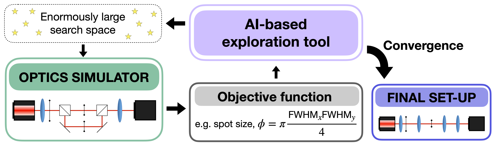
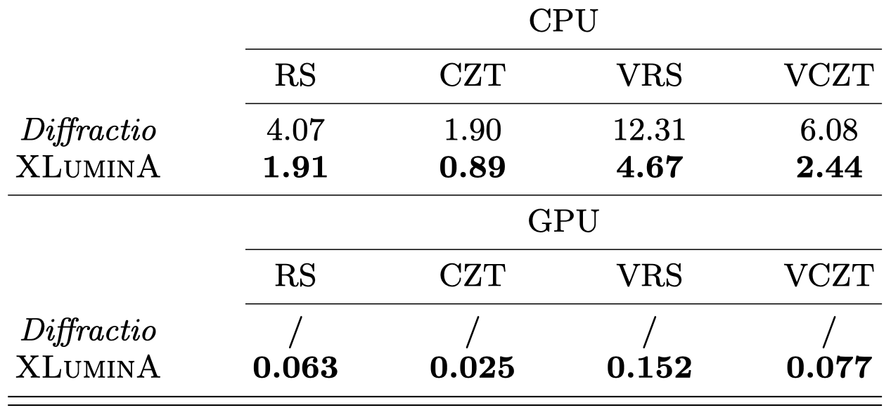
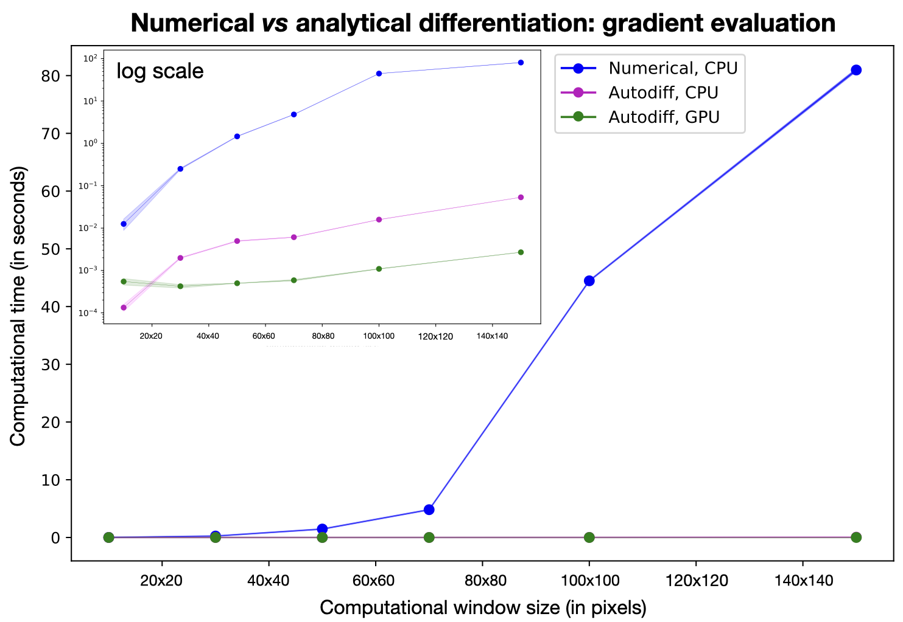
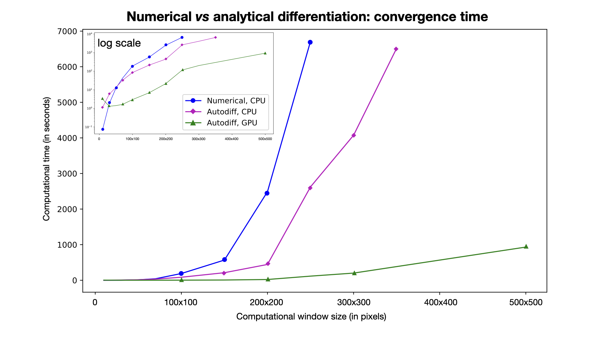

# ✨ XLuminA ✨

 **XLuminA, a highly-efficient, auto-differentiating discovery framework for super-resolution microscopy**

[**XLuminA: An Auto-differentiating Discovery Framework for Super-Resolution Microscopy**](https://arxiv.org/abs/2310.08408#)\
*Carla Rodríguez, Sören Arlt, Leonhard Möckl and Mario Krenn*

# 💻 Installation:

XLuminA can be installed with

```
pip install xlumina
```

This will install install [**JAX**](https://jax.readthedocs.io/en/latest/index.html) and **jaxlib**  - The version of JAX used in this project is v0.4.13, 

[**Optax**](https://github.com/google-deepmind/optax/tree/master) - The version of Optax used in this project is v0.1.7, 

and [**SciPy**](https://scipy.org) - The version of SciPy used in this project is v1.10.1.

*If you want to run the comparison test of the propagation functions, you need to install [**Diffractio**](https://https://pypi.org/project/diffractio/) - The version of Diffractio used in this project is v0.1.1.*

## GPU compatibility:

The package automatically installs the CPU version of JAX. To install [JAX with NVIDIA GPU support](https://jax.readthedocs.io/en/latest/index.html) (**Note: wheels only available on linux**), use:

```
# CUDA 12 installation
pip install --upgrade "jax[cuda12_pip]" -f https://storage.googleapis.com/jax-releases/jax_cuda_releases.html

# CUDA 11 installation
pip install --upgrade "jax[cuda11_pip]" -f https://storage.googleapis.com/jax-releases/jax_cuda_releases.html
```

# 👾 Features:

XLuminA allows for the simulation, in a (*very*) fast and efficient way, of classical light propagation through optics hardware configurations,and enables the optimization and automated discovery of new setup designs.


 
The simulator contains many features:

✦ Light sources (of any wavelength and power) using both scalar or vectorial optical fields.

✦ Phase masks (e.g., spatial light modulators (SLMs), polarizers and general variable retarders (LCDs)).

✦ Amplitude masks (e.g., circles, triangles and squares).

✦ Beam splitters.

✦ The light propagation methods available in XLuminA are:

  - [Fast-Fourier-transform (FFT) based numerical integration of the Rayleigh-Sommerfeld diffraction integral](https://doi.org/10.1364/AO.45.001102).
     
  - [Chirped z-transform](https://doi.org/10.1038/s41377-020-00362-z). This algorithm is an accelerated version of the Rayleigh-Sommerfeld method, which allows for arbitrary selection and sampling of the region of interest.
    
  - Propagation through [high NA objective lenses](https://doi.org/10.1016/j.optcom.2010.07.030) is availale to replicate strong focusing conditions in polarized light.
        
# 📝 Example of usage:

Examples of some experiments that can be reproduced with XLuminA are:

* Optical telescope (or 4f-correlator),
* Polarization-based beam shaping as used in [STED (stimulated emission depletion) microscopy](https://opg.optica.org/ol/fulltext.cfm?uri=ol-19-11-780&id=12352), 
* The [sharp focus of a radially polarized light beam](https://journals.aps.org/prl/abstract/10.1103/PhysRevLett.91.233901).

The code for each of these optical setups is provided in the Jupyter notebook of [examples.ipynb](https://github.com/artificial-scientist-lab/XLuminA/blob/main/xlumina/examples.ipynb).

# 🚀 Testing XLuminA's efficiency:

We evaluated our framework by conducting several tests - see [Figure 1](https://arxiv.org/abs/2310.08408#). The experiments were run on an Intel CPU Xeon Gold 6130 and Nvidia GPU Quadro RTX 6000. 

 (1) Average execution time (in seconds) over 100 runs, within a computational window size of $2048\times 2048$, for scalar and vectorial field propagation using Rayleigh-Sommerfeld (RS, VRS) and Chirped z-transform (CZT, VCZT) in [Diffractio](https://pypi.org/project/diffractio/) and XLuminA. Times for XLuminA reflect the run with pre-compiled jitted functions.



 (2) we compare the gradient evaluation times of numerical (using SciPy's [BFGS optimizer](https://docs.scipy.org/doc/scipy/reference/optimize.minimize-bfgs.html#optimize-minimize-bfgs)) *vs* analytical differentiation (using JAX's [ADAM optimizer](https://jax.readthedocs.io/en/latest/jax.example_libraries.optimizers.html)) when optimizing using XLuminA's optical simulator...
 


(3) and its convergence time:
 


The Jupyter notebook used for running these simulations is provided as [test_diffractio_vs_xlumina.ipynb](https://github.com/artificial-scientist-lab/XLuminA/blob/main/xlumina/test_diffractio_vs_xlumina.ipynb). 

# 🤖🔎 Discovery of new optical setups: 

With XLuminA we were able to re-discover three foundational optics experiments: 

➤ Optical telescope (or 4f-correlator),

➤ Polarization-based beam shaping as used in [STED (stimulated emission depletion) microscopy](https://opg.optica.org/ol/fulltext.cfm?uri=ol-19-11-780&id=12352), 

➤ The [sharp focus of a radially polarized light beam](https://journals.aps.org/prl/abstract/10.1103/PhysRevLett.91.233901).

The Python files used for the discovery of these optical setups, as detailed in [our paper](https://arxiv.org/abs/2310.08408#), are organized in pairs of `optical_table` and `optimizer` as follows:

| **Experiment name** | 🔬 Optical table | 🤖 Optimizer | 📄 File for data |
|----------------|---------------|-----------|----------|
| ***Optical telescope*** | [four_f_optical_table.py](https://github.com/artificial-scientist-lab/XLuminA/blob/main/xlumina/four_f_optical_table.py) | [four_f_optimizer.py](https://github.com/artificial-scientist-lab/XLuminA/blob/main/xlumina/four_f_optimizer.py)| [Generate_synthetic_data.py](https://github.com/artificial-scientist-lab/XLuminA/blob/main/xlumina/generate_synthetic_data.py) |
| ***Polarization-based STED*** | [vsted_optical_table.py](https://github.com/artificial-scientist-lab/XLuminA/blob/main/xlumina/vsted_optical_table.py) | [vsted_optimizer.py](https://github.com/artificial-scientist-lab/XLuminA/blob/main/xlumina/vsted_optimizer.py)| N/A |
| ***Sharp focus*** | [sharp_focus_optical_table.py](https://github.com/artificial-scientist-lab/XLuminA/blob/main/xlumina/sharp_focus_optical_table.py) | [sharp_focus_optimizer.py](https://github.com/artificial-scientist-lab/XLuminA/blob/main/xlumina/sharp_focus_optimizer.py)| N/A |

★ The large-scale setup functions are defined in [xl_optical_table.py](https://github.com/artificial-scientist-lab/XLuminA/blob/main/xlumina/xl_optical_table.py) and [xl_optimizer.py](https://github.com/artificial-scientist-lab/XLuminA/blob/main/xlumina/xl_optimizer.py). 


# 👀 Overview:

In this section we list the available functions in different files and a brief description:

1. In [wave_optics.py](https://github.com/artificial-scientist-lab/XLuminA/blob/main/xlumina/wave_optics.py): module for scalar optical fields.
   
   |*Class*|*Functions*|*Description*|
   |---------------|----|-----------|   
   | `ScalarLight`   | | Class for scalar optical fields defined in the XY plane: complex amplitude $U(r) = A(r)*e^{-ikz}$. | 
   |  | `.draw`  | Plots intensity and phase. | 
   |  | `.apply_circular_mask`  | Apply a circular mask of variable radius. |
   |  | `.apply_triangular_mask`  | Apply a triangular mask of variable size. |
   |  | `.apply_rectangular_mask`  | Apply a rectangular mask of variable size. |
   |  | `.apply_annular_aperture`  | Apply annular aperture of variable size. |
   |  | `.RS_propagation` | [Rayleigh-Sommerfeld](https://doi.org/10.1364/AO.45.001102) diffraction integral in z-direction (z>0 and z<0). |
   |  | `.get_RS_minimum_z` | Given a quality factor, determines the minimum (trustworthy) distance for `RS_propagation`.|
   |  | `.CZT` | [Chirped z-transform](https://doi.org/10.1038/s41377-020-00362-z) - efficient diffraction using the Bluestein method.|
   | `LightSource`   | | Class for scalar optical fields defined in the XY plane - defines light source beams. | |
   |  | `.gaussian_beam` | Gaussian beam. |
   |  | `.plane_wave` | Plane wave. |

     
2. In [vectorized_optics.py](https://github.com/artificial-scientist-lab/XLuminA/blob/main/xlumina/vectorized_optics.py): module for vectorized optical fields.

   |*Class*| *Functions* |*Description*|  
   |---------------|----|-----------|
   | `VectorizedLight`   | | Class for vectorized optical fields defined in the XY plane: $\vec{E} = (E_x, E_y, E_z)$| 
   |  | `.draw`  | Plots intensity, phase and amplitude. | 
   |  | `.draw_intensity_profile`  | Plots intensity profile. | 
   |  | `.VRS_propagation` | [Vectorial Rayleigh-Sommerfeld](https://iopscience.iop.org/article/10.1088/1612-2011/10/6/065004) diffraction integral in z-direction (z>0 and z<0). |
   |  | `.get_VRS_minimum_z` | Given a quality factor, determines the minimum (trustworthy) distance for `VRS_propagation`.|
   |  | `.VCZT` | [Vectorized Chirped z-transform](https://doi.org/10.1038/s41377-020-00362-z) - efficient diffraction using the Bluestein method.|
   | `PolarizedLightSource`   | | Class for polarized optical fields defined in the XY plane - defines light source beams. | |
   |  | `.gaussian_beam` | Gaussian beam. |
   |  | `.plane_wave` | Plane wave. |


 3. In [optical_elements.py](https://github.com/artificial-scientist-lab/XLuminA/blob/main/xlumina/optical_elements.py): shelf with all the optical elements available.
   
    | *Function* |*Description*|  
    |---------------|----|
    | ***Scalar light devices*** | - | 
    | `phase_scalar_SLM` | Phase mask for the spatial light modulator available for scalar fields. |
    | `SLM` | Spatial light modulator: applies a phase mask to incident scalar field. |
    | ***Jones matrices*** | - | 
    | `jones_LP` | Jones matrix of a [linear polarizer](https://doi.org/10.1201/b19711)| 
    | `jones_general_retarder` | Jones matrix of a [general retarder](https://www.researchgate.net/publication/235963739_Obtainment_of_the_polarizing_and_retardation_parameters_of_a_non-depolarizing_optical_system_from_the_polar_decomposition_of_its_Mueller_matrix). |
    | `jones_sSLM` | Jones matrix of the *superSLM*. |
    | `jones_LCD` | Jones matrix of liquid crystal display (LCD).|
    | ***Polarization-based devices*** | - | 
    |`sSLM` | *super*-Spatial Light Modulator: adds phase mask (pixel-wise) to $E_x$ and $E_y$ independently. |
    | `LCD` | Liquid crystal device: builds any linear wave-plate. | 
    | `linear_polarizer` | Linear polarizer.|
    | `BS` | Single-side coated dielectric beam splitter.|
    | `high_NA_objective_lens` | High NA objective lens (only for `VectorizedLight`).|
    | `VCZT_objective_lens` | Propagation through high NA objective lens (only for `VectorizedLight`).|
    | ***General elements*** | - | 
    | `lens` | Transparent lens of variable size and focal length.|
    | `circular_mask` | Circular mask of variable size. |
    | `triangular_mask` | Triangular mask of variable size and orientation.|
    | `rectangular_mask` | Rectangular mask of variable size and orientation.|
    | `annular_aperture` | Annular aperture of variable size.|
    | `forked_grating` | Forked grating of variable size, orientation, and topological charge. |
    | ***Pre-built optical setups*** | - | 
    | `building_block` | Basic building unit. Consists of a `sSLM`, and `LCD` linked via `VRS_propagation`. |
    | `xl_setup` | Optical table with the large set-up (*Fig.6a* of [our paper](https://arxiv.org/abs/2310.08408#)).|
    | `vSTED` | Optical table with the vectorial-based STED setup (*Fig.3a* of [our paper](https://arxiv.org/abs/2310.08408#)).|
    | `sharp_focus` | Optical table with the sharp focus of a radially polarized light beam setup (*Fig.4a* of [our paper](https://arxiv.org/abs/2310.08408#)).|
    | `general_setup` | Optical table with the general setup for large-scale discovery (*Fig.5a* of [our paper](https://arxiv.org/abs/2310.08408#)).|
    

4. In [toolbox.py](https://github.com/artificial-scientist-lab/XLuminA/blob/main/xlumina/toolbox.py): file with useful functions. 

   | *Function* |*Description*|  
   |---------------|----|
   | ***Basic operations*** | - | 
   | `space` | Builds the space where light is placed. |
   | `wrap_phase` | Wraps any phase mask into $[-\pi, \pi]$ range.|
   | `is_conserving_energy` | Computes the total intensity from the light source and compares is with the propagated light - [Ref](https://doi.org/10.1117/12.482883).|
   | `delta_kronecker` | Kronecker delta.|
   | `build_LCD_cell` | Builds the cell for `LCD`.|
   | `draw_sSLM` | Plots the two phase masks of `sSLM`.|
   | `moving_avg` | Compute the moving average of a dataset.|
   | `rotate_mask` | Rotates the (X, Y) frame w.r.t. given point. |
   | `profile` | Determines the profile of a given input without using interpolation.|
   | `spot_size` | Computes the spot size as  $\pi (FWHM_x \cdot FWHM_y) /\lambda^2$. |
   | `compute_fwhm` | Computes FWHM in 2D. |
   
5. In [loss_functions.py](https://github.com/artificial-scientist-lab/XLuminA/blob/main/xlumina/loss_functions.py): file with loss functions.

   | *Function* |*Description*|  
   |---------------|----|
   | `vMSE_Intensity` | Parallel computation of Mean Squared Error (Intensity) for a given electric field component $E_x$, $E_y$ or $E_z$. |
   | `MSE_Intensity` | Mean Squared Error (Intensity) for a given electric field component $E_x$, $E_y$ or $E_z$. |
   | `vMSE_Phase` | Parallel computation of Mean Squared Error (Phase) for a given electric field component $E_x$, $E_y$ or $E_z$. |
   | `MSE_Phase` | Mean Squared Error (Phase) for a given electric field component $E_x$, $E_y$ or $E_z$. |
   | `vMSE_Amplitude` | Parallel computation of Mean Squared Error (Amplitude) for a given electric field component $E_x$, $E_y$ or $E_z$. |
   | `MSE_Amplitude` | Mean Squared Error (Amplitude) for a given electric field component $E_x$, $E_y$ or $E_z$. |
   | `mean_batch_MSE_Intensity` | Batch-based `MSE_Intensity`.|
   | `small_area` | Fraction of intensity comprised inside the area of a mask.|
   | `small_area_STED` | Fraction of intensity comprised inside the area of a mask - STED version.|

# ⚠️ Considerations when using XLuminA:
 
 1. By default, JAX uses `float32` precision. If necessary, enable `jax.config.update("jax_enable_x64", True)` at the beginning of the file.

 2. Basic units are microns (um) and radians. Other units (centimeters, millimeters, nanometers, and degrees) are available at `__init.py__`.
 
 3. **IMPORTANT** - RAYLEIGH-SOMMERFELD PROPAGATION:
    [FFT-based diffraction calculation algorithms](https://doi.org/10.1117/12.482883) can be innacurate depending on the computational window size (sampling).\
    Before propagating light, one should check which is the minimum distance available for the simulation to be accurate.\
    You can use the following functions:

    `get_RS_minimum_z`, for `ScalarLight` class, and `get_VRS_minimum_z`, for `VectorizedLight` class.
        

# 💻 Development:

*Some functionalities of XLuminA’s optics simulator (e.g., optical propagation algorithms, planar lens or amplitude masks) are inspired in an open-source NumPy-based Python module for diffraction and interferometry simulation, [Diffractio](https://pypi.org/project/diffractio/), although we have rewritten and modified these approaches to combine them with JAX just-in-time (jit) functionality. On top of that, we developed completely new functions (e.g., beam splitters, LCDs or propagation through high NA objective lens with CZT methods, to name a few) which significantly expand the software capabilities.*

## Prerequisites:

To run XLuminA you first need to install [**JAX**](https://jax.readthedocs.io/en/latest/index.html) - The version of JAX used in this project is v0.4.13;

and [**Optax**](https://github.com/google-deepmind/optax/tree/master) - The version of Optax used in this project is v0.1.7.

*To run the comparison test of the propagation functions, you need to install [**Diffractio**](https://https://pypi.org/project/diffractio/) - The version of Diffractio used in this project is v0.1.1.*

*To run the comparison test of the optimizers, you need to install [**SciPy**](https://scipy.org) - The version of SciPy used in this project is v1.10.1.*

## Clone repository:

```
git clone https://github.com/artificial-scientist-lab/XLuminA.git
```

# 📝 How to cite XLuminA:

If you use this software, please cite as:

    @misc{rodríguez2023xlumina,
      title={XLuminA: An Auto-differentiating Discovery Framework for Super-Resolution Microscopy}, 
      author={Carla Rodríguez and Sören Arlt and Leonhard Möckl and Mario Krenn},      
      year={2023},      
      eprint={2310.08408},      
      archivePrefix={arXiv},      
      primaryClass={physics.optics}      
    }
